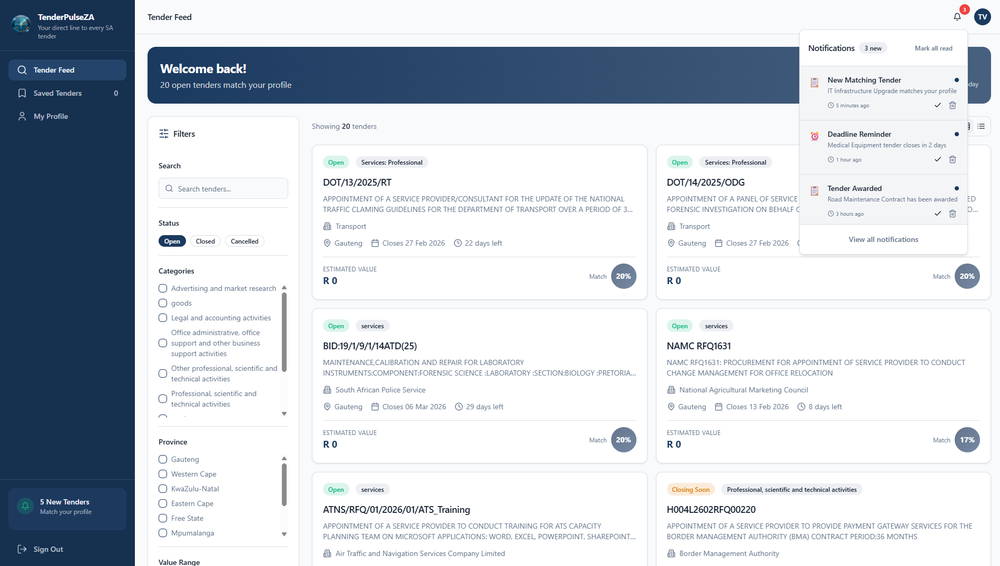
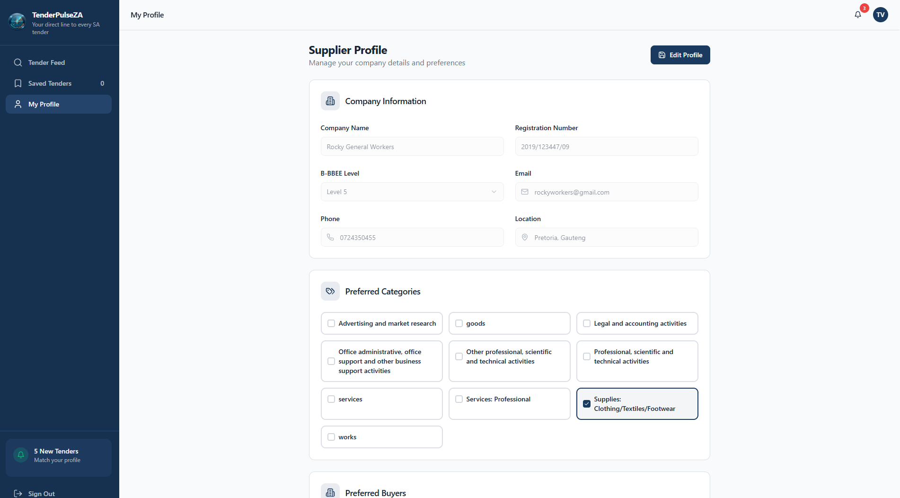
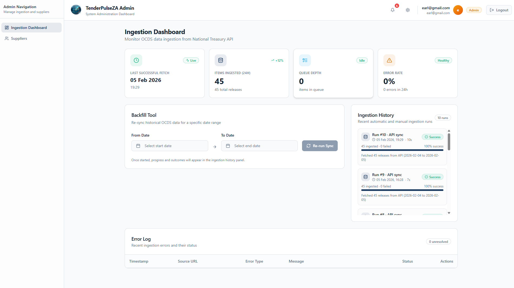

# TenderPulseZA

**Your direct line to every SA tender**

[](https://www.typescriptlang.org/)
[](https://react.dev/)
[](https://vitejs.dev/)
[](LICENSE)

TenderPulseZA is a modern web application that connects South African suppliers with government tender opportunities. Built with React, TypeScript, and a powerful Django backend, it provides real-time tender matching, personalized alerts, and an intuitive interface for discovering and managing procurement opportunities.

## The "Why"

Finding and tracking government tenders in South Africa is fragmented across multiple platforms, making it difficult for suppliers to discover relevant opportunities. TenderPulseZA solves this by:

- **Centralizing** tender data from the National Treasury OCDS API
- **Matching** tenders to supplier profiles using intelligent algorithms
- **Alerting** suppliers via Email, SMS, and WhatsApp when new opportunities match their criteria
- **Streamlining** the tender discovery and management process

## Visual Proof


*Main dashboard showing personalized tender feed with match scores*


*Supplier profile configuration with preferred categories and notification settings*


*Admin panel for managing ingestion, suppliers, and system monitoring*

> **Note:** Screenshots should be added to `docs/screenshots/` directory

## Key Features

- **Smart Matching**: AI-powered matching algorithm scores tenders based on your company profile, preferred categories, and value range
- **Real-time Updates**: Automatic ingestion every 3 hours keeps your feed fresh with the latest opportunities
- **Multi-channel Alerts**: Receive notifications via Email, SMS, and WhatsApp when new tenders match your profile
- **Advanced Filtering**: Filter by category, province, value range, and status to find exactly what you're looking for
- **Save & Track**: Save tenders for later review and track important deadlines
- **Admin Dashboard**: Comprehensive admin panel for managing suppliers, monitoring ingestion, and system health
- **Responsive Design**: Beautiful, modern UI that works seamlessly on desktop, tablet, and mobile devices

## Getting Started

### Prerequisites

- **Node.js** v18.0.0 or higher
- **npm** v9.0.0 or higher (or **bun** v1.0.0+)
- **Docker** and **Docker Compose** (for full-stack development)

### Installation

1. **Clone the repository**

```bash
git clone <YOUR_GIT_URL>
cd tenderlink-sa/frontend
```

2. **Install dependencies**

```bash
npm install
# or
bun install
```

3. **Configure environment variables**

Create a `.env` file in the `frontend` directory:

```bash
VITE_BACKEND_URL=http://localhost:8000
```

4. **Start the development server**

```bash
npm run dev
# or
bun run dev
```

The application will be available at `http://localhost:8080`

### Docker Setup (Full Stack)

For running the complete application with backend and database:

```bash
# From the project root
docker-compose up -d

# Frontend will be available at http://localhost:8080
# Backend API will be available at http://localhost:8000
```

## Usage & Examples

### Quick Start

1. **Sign up** for a new account at `/signup`
2. **Complete onboarding** to set up your supplier profile:
   - Company information
   - Preferred categories
   - Location preferences
   - Value range
   - Notification preferences
3. **Browse tenders** on the main feed, filtered by your preferences
4. **Save tenders** by clicking the bookmark icon
5. **View details** by clicking on any tender card

### Example: Filtering Tenders

```typescript
// The FilterSidebar component automatically handles filtering
// Categories are dynamically loaded from the backend API
const filters = {
  search: "construction",
  categories: ["Construction", "Services: General"],
  provinces: ["Gauteng", "Western Cape"],
  minValue: 100000,
  maxValue: 50000000,
  status: ["active"]
};
```

### Example: Updating Supplier Profile

```typescript
import { updateSupplierProfile } from '@/lib/api';

await updateSupplierProfile({
  preferredCPVs: ["72000000", "33000000"],
  minValue: 500000,
  maxValue: 50000000,
  emailNotifications: true,
  smsNotifications: false,
  whatsappNotifications: true
});
```

## Configuration

### Environment Variables

| Variable | Description | Default |
|----------|-------------|---------|
| `VITE_BACKEND_URL` | Backend API base URL | `http://localhost:8000` |

### Build Configuration

```bash
# Development build
npm run build:dev

# Production build
npm run build

# Preview production build
npm run preview
```

### Available Scripts

| Command | Description |
|---------|-------------|
| `npm run dev` | Start development server with hot-reload |
| `npm run build` | Build for production |
| `npm run build:dev` | Build for development |
| `npm run preview` | Preview production build locally |
| `npm run lint` | Run ESLint |
| `npm run test` | Run tests |
| `npm run test:watch` | Run tests in watch mode |

## Project Structure

```
frontend/
├── public/                 # Static assets
│   ├── TenderPulse Logo.PNG
│   └── favicon.ico
├── src/
│   ├── components/        # React components
│   │   ├── admin/         # Admin-specific components
│   │   ├── ui/            # shadcn/ui components
│   │   └── ...
│   ├── contexts/          # React contexts (Auth, etc.)
│   ├── data/              # Mock data and constants
│   ├── hooks/             # Custom React hooks
│   ├── lib/               # Utilities and API client
│   ├── pages/             # Page components
│   ├── types/             # TypeScript type definitions
│   └── main.tsx           # Application entry point
├── index.html
├── package.json
├── tailwind.config.ts
├── tsconfig.json
└── vite.config.ts
```

## Technologies Used

- **Vite** - Next-generation frontend build tool
- **React 18** - UI library with hooks and concurrent features
- **TypeScript** - Type-safe JavaScript
- **Tailwind CSS** - Utility-first CSS framework
- **shadcn/ui** - High-quality React component library
- **React Router** - Client-side routing
- **TanStack Query** - Data fetching and caching
- **Sonner** - Toast notifications
- **Lucide React** - Icon library

## Roadmap

### v1.1 (Upcoming)
- [ ] Enhanced match scoring algorithm
- [ ] Export saved tenders to PDF/CSV
- [ ] Calendar integration for deadline tracking
- [ ] Mobile app (React Native)

### v1.2 (Future)
- [ ] Advanced analytics dashboard
- [ ] Bid submission tracking
- [ ] Collaboration features for teams
- [ ] API access for enterprise customers

## Contributing

Contributions are welcome! Here's how you can help:

1. **Fork the repository**
2. **Create a feature branch** (`git checkout -b feature/amazing-feature`)
3. **Commit your changes** (`git commit -m 'Add some amazing feature'`)
4. **Push to the branch** (`git push origin feature/amazing-feature`)
5. **Open a Pull Request**

### Development Guidelines

- Follow the existing code style (ESLint configuration included)
- Write TypeScript types for all new components
- Add tests for new features
- Update documentation as needed

## License

This project is licensed under the MIT License - see the [LICENSE](LICENSE) file for details.

## Acknowledgments

- **National Treasury (South Africa)** - For providing the OCDS API
- **shadcn/ui** - For the excellent component library
- **Radix UI** - For accessible, unstyled component primitives
- **Vite Team** - For the blazing-fast build tool

## Support

For issues, questions, or feature requests, please open an issue on GitHub.

---

**Made with ❤️ for South African suppliers by Lucky Mtshali**
